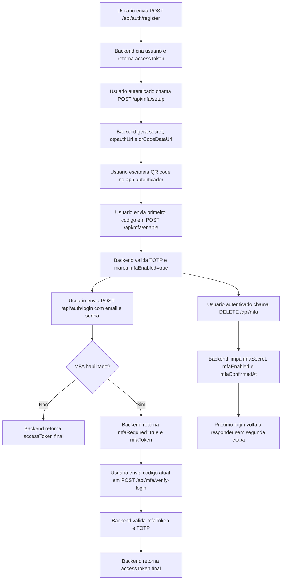

# Auth and MFA Flow

## Objetivo

Documentar visualmente o fluxo de cadastro, configuracao do MFA por TOTP e login em duas etapas.

## Visao geral

O backend segue este comportamento:

- cadastro retorna JWT imediatamente
- setup do MFA acontece depois, com usuario autenticado
- o QR code e escaneado no Microsoft Authenticator ou app equivalente
- a ativacao do MFA exige a confirmacao do primeiro codigo TOTP
- quando o MFA esta habilitado, o login passa a exigir uma segunda etapa
- se o MFA for removido, o login volta a responder com o JWT final na primeira etapa

## Diagrama

## Passo a passo resumido

1. O usuario se registra em `POST /api/auth/register`.
2. O backend retorna o JWT inicial para que o usuario possa configurar a propria conta.
3. O usuario chama `POST /api/mfa/setup` autenticado.
4. O backend entrega `secret`, `otpauthUrl` e `qrCodeDataUrl`.
5. O usuario escaneia o QR code no Microsoft Authenticator.
6. O usuario confirma o primeiro codigo em `POST /api/mfa/enable`.
7. Depois disso, `POST /api/auth/login` passa a responder com `mfaRequired=true`.
8. O usuario conclui a autenticacao em `POST /api/mfa/verify-login`.
9. Se quiser remover o segundo fator, o usuario chama `DELETE /api/mfa`.

## Referencias

- [README.md](e:/directads/README.md)
- [api.md](e:/directads/docs/api.md)
- [setup.md](e:/directads/docs/setup.md)
- [tasks-log.md](e:/directads/docs/tasks-log.md)
